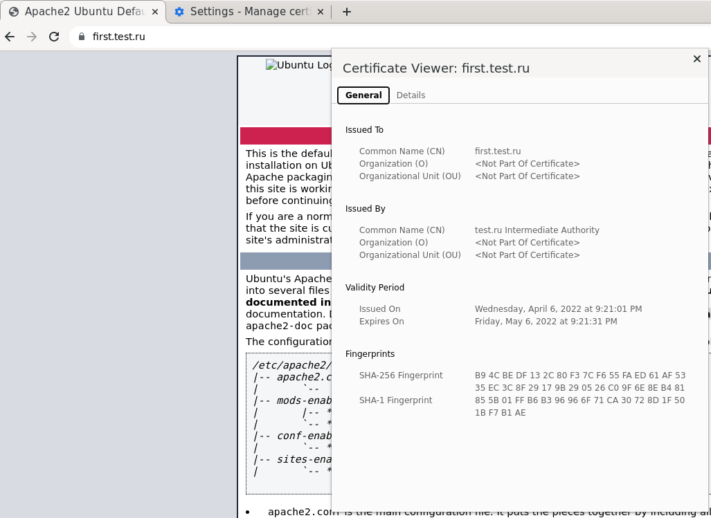
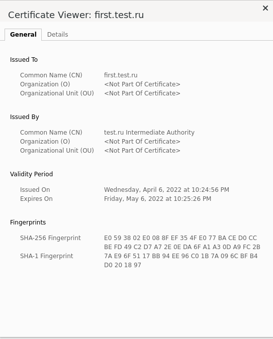

# Курсовая работа по итогам модуля "DevOps и системное администрирование"

Курсовая работа необходима для проверки практических навыков, полученных в ходе прохождения курса "DevOps и системное администрирование".

Мы создадим и настроим виртуальное рабочее место. Позже вы сможете использовать эту систему для выполнения домашних заданий по курсу

## Задание

1. Создайте виртуальную машину Linux.
2. Установите ufw и разрешите к этой машине сессии на порты 22 и 443, при этом трафик на интерфейсе localhost (lo) должен ходить свободно на все порты.
```bash
 sudo apt-get install ufw -y
 ip addr
 sudo ufw allow in on eth0 to any port 22
 sudo ufw allow in on eth0 to any port 443
 sudo ufw enable 
 sudo ufw status verbose 
```
3. Установите hashicorp vault ([инструкция по ссылке](https://learn.hashicorp.com/tutorials/vault/getting-started-install?in=vault/getting-started#install-vault)).
4. Cоздайте центр сертификации по инструкции ([ссылка](https://learn.hashicorp.com/tutorials/vault/pki-engine?in=vault/secrets-management)) и выпустите сертификат для использования его в настройке веб-сервера nginx (срок жизни сертификата - месяц).
```bash
# Prerequisites
sudo apt-get install jq
# Start Vault
vault server -dev -dev-root-token-id root
export VAULT_ADDR=http://127.0.0.1:8200
export VAULT_TOKEN=root

# Generate root CA
vault secrets enable pki
vault secrets tune -max-lease-ttl=8640h pki
vault write -field=certificate pki/root/generate/internal \
     common_name="test.ru" \
     ttl=8640h > CA_cert.crt
vault write pki/config/urls \
     issuing_certificates="$VAULT_ADDR/v1/pki/ca" \
     crl_distribution_points="$VAULT_ADDR/v1/pki/crl"
     
# Generate intermediate CA
vault secrets enable -path=pki_int pki
vault secrets tune -max-lease-ttl=8640h pki_int
vault write -format=json pki_int/intermediate/generate/internal \
      common_name="test.ru Intermediate Authority" | jq -r '.data.csr' > pki_intermediate.csr
vault write -format=json pki/root/sign-intermediate \
      csr=@pki_intermediate.csr format=pem_bundle ttl="86400h" | jq -r '.data.certificate' > intermediate.cert.pem
vault write pki_int/intermediate/set-signed certificate=@intermediate.cert.pem

# Create a role
vault write pki_int/roles/test-dot-ru  \
      allowed_domains="test.ru" \
      allow_subdomains=true  \
      max_ttl="8640h"

# Request certificates
vault write -format=json  pki_int/issue/test-dot-ru \
      common_name="first.test.ru" \
      ttl="720h" > /etc/nginx/ssl/first.test.ru.all

# Parse certificate
cat /etc/nginx/ssl/first.test.ru.all  | jq -r .data.private_key > /etc/nginx/ssl/first.test.ru.key
cat /etc/nginx/ssl/first.test.ru.all  | jq -r .data.certificate >  /etc/nginx/ssl/first.test.ru.cert
cat /etc/nginx/ssl/first.test.ru.all  | jq -r .data.issuing_ca >>  /etc/nginx/ssl/first.test.ru.cert
```
5. Установите корневой сертификат созданного центра сертификации в доверенные в хостовой системе.
6. Установите nginx.
```bash
sudo apt update
sudo apt install nginx
systemctl status nginx
# nginx был в статусе inactive. Для исправления необходимо было выполнить команды ниже 
sudo systemctl stop apache2
sudo systemctl start nginx
```
7. По инструкции ([ссылка](https://nginx.org/en/docs/http/configuring_https_servers.html)) настройте nginx на https, используя ранее подготовленный сертификат:
- можно использовать стандартную стартовую страницу nginx для демонстрации работы сервера;
- можно использовать и другой html файл, сделанный вами;
```bash
cd /etc/nginx/sites-enabled
sudo nano first.test.ru

server {
    access_log /var/log/nginx/first.test.ru.log;
    #access_log off;
    error_log /var/log/nginx/first.test.ru.error.log;

    root /var/www/html;
    index index.html index.htm index.nginx-debian.html;

    listen 443 ssl;
    server_name first.test.ru;

    location / {
        error_page 404 /404.html;
        location = /404.html 
    {
                root /var/www/html;
                internal;
        }
    }

    ssl_certificate /etc/nginx/ssl/first.test.ru.cert;
    ssl_certificate_key /etc/nginx/ssl/first.test.ru.key;

    ssl_session_cache shared:le_nginx_SSL:1m;
    ssl_session_timeout 1440m;
    ssl_protocols TLSv1 TLSv1.1 TLSv1.2;
    ssl_prefer_server_ciphers on;
    ssl_ciphers "ECDHE-ECDSA-CHACHA20-POLY1305:ECDHE-RSA-CHACHA20-POLY1305:ECDHE-ECDSA-AES128-GCM-SHA256:ECDHE-RSA-AES128-GCM-SHA256:ECDHE-ECDSA-AES256-GCM-SHA384:ECDHE-RSA-AES256-GCM-SHA384:DHE-RSA-AES128-GCM-SHA256:DHE-RSA-AES256-GCM-SHA384:ECDHE-ECDSA-AES128-SHA256:ECDHE-RSA-AES128-SHA256:ECDHE-ECDSA-AES128-SHA:ECDHE-RSA-AES256-SHA384:ECDHE-RSA-AES128-SHA:ECDHE-ECDSA-AES256-SHA384:ECDHE-ECDSA-AES256-SHA:ECDHE-RSA-AES256-SHA:DHE-RSA-AES128-SHA256:DHE-RSA-AES128-SHA:DHE-RSA-AES256-SHA256:DHE-RSA-AES256-SHA:ECDHE-ECDSA-DES-CBC3-SHA:ECDHE-RSA-DES-CBC3-SHA:EDH-RSA-DES-CBC3-SHA:AES128-GCM-SHA256:AES256-GCM-SHA384:AES128-SHA256:AES256-SHA256:AES128-SHA:AES256-SHA:DES-CBC3-SHA:!DSS";
    
}

sudo service nginx restart
```
8. Откройте в браузере на хосте https адрес страницы, которую обслуживает сервер nginx.


9. Создайте скрипт, который будет генерировать новый сертификат в vault:
- генерируем новый сертификат так, чтобы не переписывать конфиг nginx;
- перезапускаем nginx для применения нового сертификата.
```bash
nano /root/cert_generator.sh


#!/usr/bin/bash

export VAULT_ADDR=http://127.0.0.1:8200
export VAULT_TOKEN=root

vault write -format=json  pki_int/issue/test-dot-ru common_name="first.test.ru" ttl="720h" > /etc/nginx/ssl/first.test.ru.all
cat /etc/nginx/ssl/first.test.ru.all  | jq -r .data.private_key > /etc/nginx/ssl/first.test.ru.key
cat /etc/nginx/ssl/first.test.ru.all  | jq -r .data.certificate >  /etc/nginx/ssl/first.test.ru.cert
cat /etc/nginx/ssl/first.test.ru.all  | jq -r .data.issuing_ca >>  /etc/nginx/ssl/first.test.ru.cert
```
10. Поместите скрипт в crontab, чтобы сертификат обновлялся какого-то числа каждого месяца в удобное для вас время.
```bash
nano /etc/crontab

0 0 0 5/30 1/1 ? *  root  sh /root/cert_generator.sh
```

======== Проверка работы crontab =====
```bash
nano /etc/crontab

*/3 * * * * root  sh /root/cert_generator.sh
```


## Результат

Результатом курсовой работы должны быть снимки экрана или текст:

- Процесс установки и настройки ufw
- Процесс установки и выпуска сертификата с помощью hashicorp vault
- Процесс установки и настройки сервера nginx
- Страница сервера nginx в браузере хоста не содержит предупреждений
- Скрипт генерации нового сертификата работает (сертификат сервера ngnix должен быть "зеленым")
- Crontab работает (выберите число и время так, чтобы показать что crontab запускается и делает что надо)

## Как сдавать курсовую работу

Курсовую работу выполните в файле readme.md в github репозитории. В личном кабинете отправьте на проверку ссылку на .md-файл в вашем репозитории.

Также вы можете выполнить задание в [Google Docs](https://docs.google.com/document/u/0/?tgif=d) и отправить в личном кабинете на проверку ссылку на ваш документ.
Если необходимо прикрепить дополнительные ссылки, просто добавьте их в свой Google Docs.

Перед тем как выслать ссылку, убедитесь, что ее содержимое не является приватным (открыто на комментирование всем, у кого есть ссылка), иначе преподаватель не сможет проверить работу.
Ссылка на инструкцию [Как предоставить доступ к файлам и папкам на Google Диске](https://support.google.com/docs/answer/2494822?hl=ru&co=GENIE.Platform%3DDesktop).
