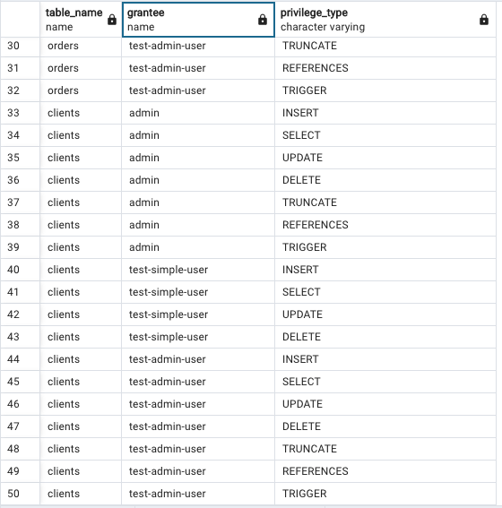
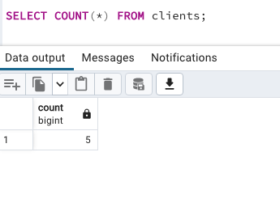
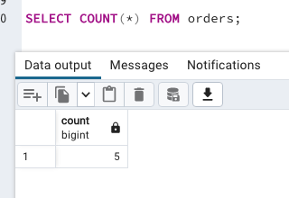
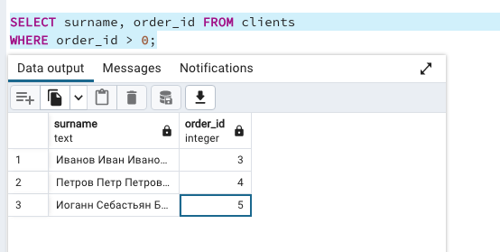
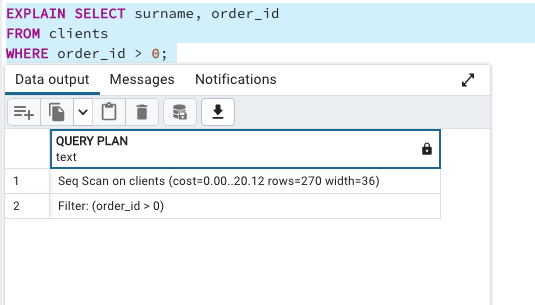

# Домашнее задание к занятию "6.2. SQL"

## Задача 1

Используя docker поднимите инстанс PostgreSQL (версию 12) c 2 volume,
в который будут складываться данные БД и бэкапы.

Приведите получившуюся команду или docker-compose манифест.

---

[docker-compose.yaml](06-db-02-sql/docker-compose.yaml)

## Задача 2

В БД из задачи 1:
- создайте пользователя test-admin-user и БД test_db
- в БД test_db создайте таблицу orders и clients (спeцификация таблиц ниже)
- предоставьте привилегии на все операции пользователю test-admin-user на таблицы БД test_db
- создайте пользователя test-simple-user
- предоставьте пользователю test-simple-user права на SELECT/INSERT/UPDATE/DELETE данных таблиц БД test_db

Таблица orders:
- id (serial primary key)
- наименование (string)
- цена (integer)

Таблица clients:
- id (serial primary key)
- фамилия (string)
- страна проживания (string, index)
- заказ (foreign key orders)

Приведите:
- итоговый список БД после выполнения пунктов выше,
```
List of databases
   Name    | Owner | Encoding |  Collate   |   Ctype    |      Access privileges      
-----------+-------+----------+------------+------------+-----------------------------
 apkdb     | admin | UTF8     | en_US.utf8 | en_US.utf8 | 
 template0 | admin | UTF8     | en_US.utf8 | en_US.utf8 | =c/admin                   +
           |       |          |            |            | admin=CTc/admin
 template1 | admin | UTF8     | en_US.utf8 | en_US.utf8 | =c/admin                   +
           |       |          |            |            | admin=CTc/admin
 test_db   | admin | UTF8     | en_US.utf8 | en_US.utf8 | =Tc/admin                  +
           |       |          |            |            | admin=CTc/admin            +
           |       |          |            |            | "test-admin-user"=CTc/admin
```
- описание таблиц (describe)
```
 \d orders
               Table "public.orders"
 Column |  Type   | Collation | Nullable | Default 
--------+---------+-----------+----------+---------
 id     | integer |           | not null | 
 name   | text    |           |          | 
 price  | integer |           |          | 
Indexes:
    "orders_pkey" PRIMARY KEY, btree (id)
Referenced by:
    TABLE "clients" CONSTRAINT "fk_orders" FOREIGN KEY ("order") REFERENCES orders(id)
    TABLE "shop.clients" CONSTRAINT "fk_orders" FOREIGN KEY ("order") REFERENCES orders(id)
```
```
test_db=# \d clients
               Table "public.clients"
 Column  |  Type   | Collation | Nullable | Default 
---------+---------+-----------+----------+---------
 id      | integer |           | not null | 
 surname | text    |           |          | 
 country | text    |           |          | 
 order   | integer |           |          | 
Indexes:
    "clients_pkey" PRIMARY KEY, btree (id)
    "country" btree (country)
Foreign-key constraints:
    "fk_orders" FOREIGN KEY ("order") REFERENCES orders(id)
```
- SQL-запрос для выдачи списка пользователей с правами над таблицами test_db
```roomsql
SELECT table_name, grantee, privilege_type 
FROM information_schema.role_table_grants 
WHERE table_name IN ('clients', 'orders');
```
- список пользователей с правами над таблицами test_db



## Задача 3

Используя SQL синтаксис - наполните таблицы следующими тестовыми данными:

Таблица orders

| Наименование | цена  |
|--------------|-------|
| Шоколад      | 10    |
| Принтер      | 3000  |
| Книга        | 500   |
| Монитор      | 7000  |
| Гитара       | 4000  |

Таблица clients

| ФИО                  | Страна проживания |
|----------------------|-------------------|
| Иванов Иван Иванович | USA               |
| Петров Петр Петрович | Canada            |
| Иоганн Себастьян Бах | Japan             |
| Ронни Джеймс Дио     | Russia            |
| Ritchie Blackmore    | Russia            |

Используя SQL синтаксис:
- вычислите количество записей для каждой таблицы
- приведите в ответе:
    - запросы
    - результаты их выполнения.
   
 <br>


## Задача 4

Часть пользователей из таблицы clients решили оформить заказы из таблицы orders.

Используя foreign keys свяжите записи из таблиц, согласно таблице:

| ФИО                  | Заказ   |
|----------------------|---------|
| Иванов Иван Иванович | Книга   |
| Петров Петр Петрович | Монитор |
| Иоганн Себастьян Бах | Гитара  |

Приведите SQL-запросы для выполнения данных операций.

```roomsql
UPDATE clients SET order_id = (SELECT id FROM orders WHERE name = 'Книга') 
WHERE clients.surname = 'Иванов Иван Иванович';

UPDATE clients SET order_id = (SELECT id FROM orders WHERE name = 'Монитор') 
WHERE clients.surname = 'Петров Петр Петрович';

UPDATE clients SET order_id = (SELECT id FROM orders WHERE name = 'Гитара') 
WHERE clients.surname = 'Иоганн Себастьян Бах';
```

Приведите SQL-запрос для выдачи всех пользователей, которые совершили заказ, а также вывод данного запроса.

```roomsql
SELECT surname, order_id 
FROM clients 
WHERE order_id > 0;
```


Подсказк - используйте директиву `UPDATE`.

## Задача 5

Получите полную информацию по выполнению запроса выдачи всех пользователей из задачи 4
(используя директиву EXPLAIN).

Приведите получившийся результат и объясните что значат полученные значения.

```roomsql
EXPLAIN SELECT surname, order_id 
FROM clients 
WHERE order_id > 0; 
```

Для фильтра order_id > 0 мы видим: <br>

cost - Приблизительная стоимость запуска. Это время, которое проходит, прежде чем начнётся этап вывода данных, например 
для сортирующего узла это время сортировки. <br>
Приблизительная общая стоимость (после ..). Она вычисляется в предположении, что узел плана выполняется до конца, то есть 
возвращает все доступные строки. На практике родительский узел может досрочно прекратить чтение строк 
дочернего. <br>

rows - Ожидаемое число строк, которое должен вывести этот узел плана. При этом так же предполагается, что узел выполняется до конца. <br>

width - Ожидаемый средний размер строк, выводимых этим узлом плана (в байтах).
## Задача 6

Создайте бэкап БД test_db и поместите его в volume, предназначенный для бэкапов (см. Задачу 1).
```bash
pg_dump -U admin test_db > /var/backups/backup.sql
```
Остановите контейнер с PostgreSQL (но не удаляйте volumes).
```bash
docker-compose down
```

Поднимите новый пустой контейнер с PostgreSQL.
```bash
docker-compose up
```

Восстановите БД test_db в новом контейнере.

```bash
psql -U admin -d test_db < /var/backups/backup.sql
```

Приведите список операций, который вы применяли для бэкапа данных и восстановления. 