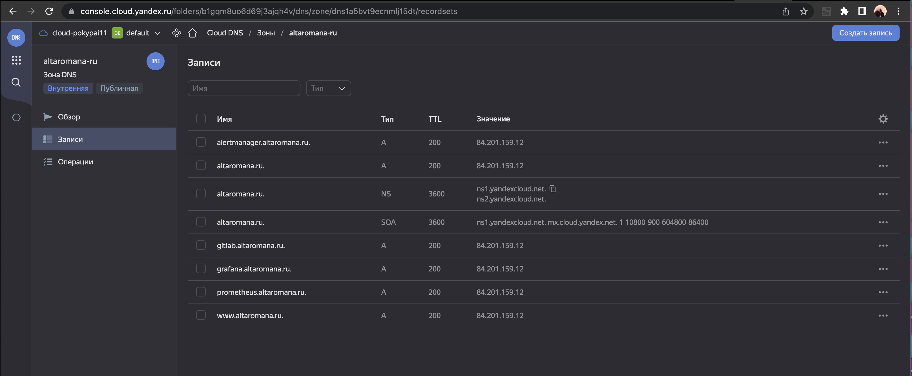
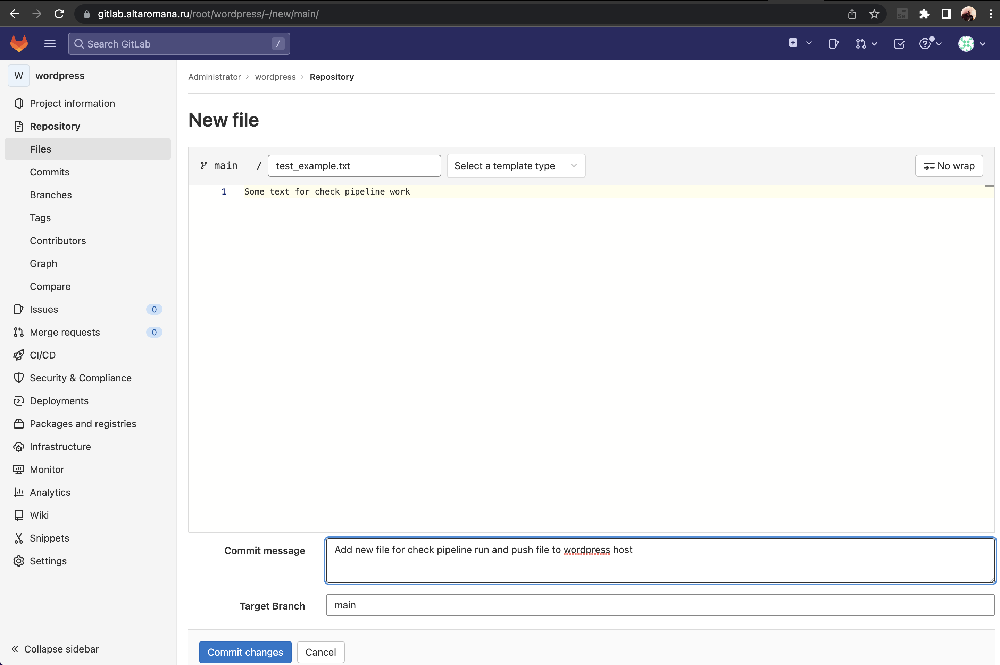

## Регистрация доменного имени 


## Создание инфраструктуры

```tf
terraform init
terraform workspace new stage
terraform init
terraform plan
terraform apply --auto-approve
terraform output -json > output.json
```




## Установка Nginx и LetsEncrypt
`ansible-playbook proxy.yml -i hosts`


## Установка кластера MySQL
```bash
# ставим недостающие модули
ansible-galaxy collection install community.mysql
ansible-playbook mysql.yml -i hosts  ansible-playbook mysql.yml -i hosts  
```
<details><summary>Вывод консоли</summary>

```bash
ansible git:(main) ✗ ansible-playbook mysql.yml -i hosts              

PLAY [db01 db02] *****************************************************************************************************************************************************************************************

TASK [Gathering Facts] ***********************************************************************************************************************************************************************************
ok: [db01.altaromana.ru]
ok: [db02.altaromana.ru]

TASK [mysql : Installing Mysql and dependencies] *********************************************************************************************************************************************************
changed: [db02.altaromana.ru] => (item=mysql-server)
changed: [db01.altaromana.ru] => (item=mysql-server)
changed: [db02.altaromana.ru] => (item=mysql-client)
changed: [db01.altaromana.ru] => (item=mysql-client)
changed: [db02.altaromana.ru] => (item=python3-mysqldb)
changed: [db01.altaromana.ru] => (item=python3-mysqldb)
changed: [db02.altaromana.ru] => (item=libmysqlclient-dev)
changed: [db01.altaromana.ru] => (item=libmysqlclient-dev)

TASK [mysql : start and enable mysql service] ************************************************************************************************************************************************************
ok: [db01.altaromana.ru]
ok: [db02.altaromana.ru]

TASK [mysql : Creating database wordpress] ***************************************************************************************************************************************************************
changed: [db01.altaromana.ru]
changed: [db02.altaromana.ru]

TASK [mysql : Creating mysql user wordpress] *************************************************************************************************************************************************************
changed: [db02.altaromana.ru]
changed: [db01.altaromana.ru]

TASK [mysql : Enable remote login to mysql] **************************************************************************************************************************************************************
changed: [db01.altaromana.ru]
changed: [db02.altaromana.ru]

TASK [mysql : Remove anonymous MySQL users.] *************************************************************************************************************************************************************
ok: [db01.altaromana.ru]
ok: [db02.altaromana.ru]

TASK [mysql : Remove MySQL test database.] ***************************************************************************************************************************************************************
ok: [db02.altaromana.ru]
ok: [db01.altaromana.ru]

TASK [mysql : Copy master.cnf] ***************************************************************************************************************************************************************************
skipping: [db02.altaromana.ru]
changed: [db01.altaromana.ru]

TASK [mysql : Copy slave.cnf] ****************************************************************************************************************************************************************************
skipping: [db01.altaromana.ru]
changed: [db02.altaromana.ru]

TASK [mysql : Ensure replication user exists on master.] *************************************************************************************************************************************************
skipping: [db02.altaromana.ru]
changed: [db01.altaromana.ru]

TASK [mysql : check slave replication status] ************************************************************************************************************************************************************
skipping: [db01.altaromana.ru]
ok: [db02.altaromana.ru]

TASK [mysql : Check master replication status] ***********************************************************************************************************************************************************
skipping: [db01.altaromana.ru]
ok: [db02.altaromana.ru -> db01.altaromana.ru(192.168.102.19)]

TASK [mysql : configure replication on the slave] ********************************************************************************************************************************************************
skipping: [db01.altaromana.ru]
changed: [db02.altaromana.ru]

TASK [mysql : start replication] *************************************************************************************************************************************************************************
skipping: [db01.altaromana.ru]
changed: [db02.altaromana.ru]

RUNNING HANDLER [mysql : Restart mysql] ******************************************************************************************************************************************************************
changed: [db01.altaromana.ru]
changed: [db02.altaromana.ru]

PLAY RECAP ***********************************************************************************************************************************************************************************************
db01.altaromana.ru         : ok=11   changed=7    unreachable=0    failed=0    skipped=5    rescued=0    ignored=0   
db02.altaromana.ru         : ok=14   changed=8    unreachable=0    failed=0    skipped=2    rescued=0    ignored=0   
```
</details>

## Установка WordPress

```bash
ansible-playbook app.yml -i hosts
```


## Установка Gitlab CE и Gitlab Runner

```bash
ansible-playbook gitlab.yml -i hosts
```

После выполнения авторизуемся: root/P@ssw0rd <br>

#### Создаем проект


с Подключаемся к машине с wordpress, инициализиуем в папке wordpress гит репозиторий, добавляем все файлы и пушим в гитлаб
```bash
ssh user@altaromana.ru
# создам файл auth_key.txt с приватным ключем с хостовой машины и подключаемся к app
ssh -i auth_key.txt user@app.altaromana.ru
# переходим в директорию /var/www/wordpress
sudo vi .gitignore
sudo git config --global init.defaultBranch main
sudo git config --global --add safe.directory /var/www/wordpress
sudo git init
sudo git add .
sudo git commit -m "Initial commit"
sudo git push --set-upstream http://gitlab.altaromana.ru/root/wordpress.git main
```


#### Добавляем необходимые переменные

Добавим переменную ssh_key с приватным ключом хостовой машины в gitLab Settings -> CI/CD -> Variables.  
Это нужно для авторизации runner.

#### Настраиваем pipeline

Переходим в CI/CD -> Editor -> Configure pipeline и вставляем код:

```bash
---
before_script:
  - 'which ssh-agent || ( apt-get update -y && apt-get install openssh-client -y )'
  - eval $(ssh-agent -s)
  - echo "$ssh_key" | tr -d '\r' | ssh-add -
  - mkdir -p ~/.ssh
  - chmod 700 ~/.ssh

stages:
  - deploy

deploy-job:
  stage: deploy
  script:
    - echo "Sync files"
    - ssh -o StrictHostKeyChecking=no user@app.altaromana.ru sudo chown user /var/www/wordpress/ -R
    - rsync -arvzc -e "ssh -o StrictHostKeyChecking=no" ./* user@app.altaromana.ru:/var/www/wordpress/
    - ssh -o StrictHostKeyChecking=no user@app.altaromana.ru sudo chown www-data /var/www/wordpress/ -R
```

#### Запускаем runner

В файле ansible/roles/runner/defaults/main.yml вписываем gitlab_runner_registration_token <br>
Далее устанавливаем недостающие модули и запускаем runner
```bash
ansible-galaxy collection install ansible.windows
ansible-galaxy collection install community.windows
ansible-playbook runner.yml -i hosts
```


#### Проверяем что Pipeline запускается при коммите изменений и добавляемые файлы кладутся на сервер




## Установка Prometheus, Alert Manager, Node Exporter и Grafana

#### Разворачиваем Node Exporter  

```bash
ansible-playbook node_exporter.yml -i hosts
```

#### Разворачиваем Prometheus, Alertmanager, Grafana 

```bash
# ставим недостающие модули
ansible-galaxy collection install ansible.posix
ansible-playbook monitoring.yml -i hosts
```


!!! В КОНЦЕ НЕ ЗАБЫТЬ ПОТУШИТЬ ИНФРАСТРУКТУРУ И ПОХВАЛИТЬ СЕБЯ :) !!!
`terraform destroy --auto-approve`